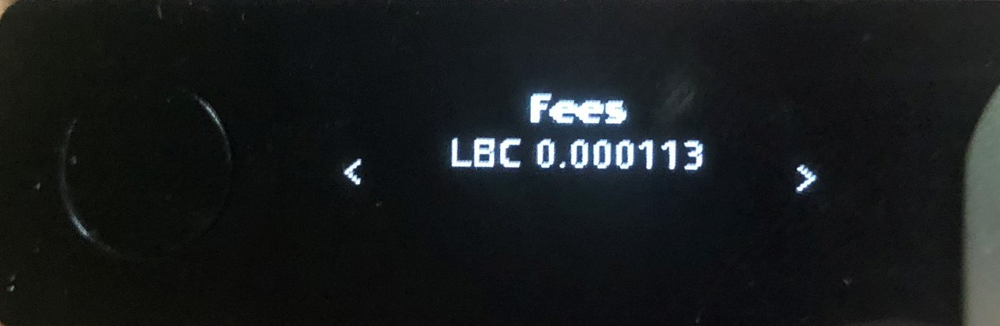

# LBRY Vault Guide for Hardware Wallet

A Hardware wallet are considered as a very secure storage device of a user’s private keys in the blockchain world. Your digital assets are safe even when using an infected (or untrusted) PC, data breaches of password managers and cloud storage providers.

# Install the LBRY Vault app on Ledger Nano S/X

### Before you begin
- You have [initialized](https://support.ledgerwallet.com/hc/en-us/articles/360000613793&sa=D&ust=1582572545402000) your Ledger Device (supported Nano S and Nano X)
- The [latest firmware](https://support.ledgerwallet.com/hc/en-us/articles/360002731113-Update-Ledger-Nano-S-firmware&sa=D&ust=1582572545403000) is installed
- [Ledger Live](https://support.ledger.com/hc/en-us/articles/360006395233-Take-your-first-steps&sa=D&ust=1582572545403000) is ready to use
- Latest version of Bitcoin app installed via Ledger Live
- [LBRY Vault](https://github.com/LBRYFoundation/LBRY-Vault/releases)

### Instructions
1. Open the Manager in Ledger Live.
2. Connect and unlock your Ledger Nano S.
3. If asked, allow the manager on your device by pressing the right button.
4. Find LBRY in the app catalog.
5. Click the Install button of the app.
6. An installation window appears.
7. Your device will display Processing…
8. The app installation is confirmed.

If you want to setup Multi Signature wallet follow [this guide.](https://lbry.com/faq/multisig)

## Use your Ledger device with LBRY Vault

Currently to store you need to use modified version of Electrum app which has been modified to support LBRY Credits.

1. Simply connect and unlock your Ledger device;
2. Open the LBRY app on the device;
3. Open LBRY Vault app on PC;
4. At the first screen select “Auto connect” and press next;
5. On the next screen input name of your choice and press next;
6. Chose “Standard wallet” and press next;
7. Make sure your Ledger device is plugged in and select “Use a hardware device”;
8. On the next screen choose your Ledger device and press next;
9. Choose “Legacy” and press next;
10. Select “Encrypt wallet file” and press next;

# Receive LBRY Credits (LBC) through Ledger device

It is important to test a single small transaction incoming and outgoing before using the wallet to store larger amounts.

1. Open LBRY Vault app;
2. Go to receive tab;
3. Press “On-chain” button;
4. The address you need to send LBC to will show up on the right side of the screen.

# Send LBRY Credits (LBC) through Ledger device

1. Open LBRY Vault app;
2. On Ledger device open LBRY App;
3. In LBRY Vault app go to Send tab;
4. Insert LBC address and amount and press Pay;
5. On next window you need to confirm transaction by pressing Send;
6. Confirm transaction on your Ledger Device;

Check if the amount and address match the LBRY Vault.

If everything is the same as in the LBRY Vault app you can press accept.

The next step is to check and approve fees.

If everything is correct you can confirm transaction.

You will get pop-up confirming that transaction has been sent.

# Running on MacOS
If you want to run LBRY Vault on MacOS follow this steps:

1. Open terminal.
2. Clone repository with ``git clone https://github.com/kodxana/LBRY-Vault``
3. Enter directory with command ``cd LBRY-Vault``
4. Download and install [Python 3.6.4](https://www.python.org/ftp/python/3.6.4/python-3.6.4-macosx10.6.pkg)
5. Enter command ``python3 -m pip install --user .``

After that you can run LBRY Vault by using ``./run_electrum``

# Troubleshooting

If you have problems with connecting to LBRY Spv1 Wallet server, try community hosted wallet server compatible with LBRY Vault.

|spv1.allaboutlbc.com:50001 | Hosted by Madiator2011|

# Support

If you have problems with setup of LBRY Vault you can reach us at:
- [Discord](https://chat.lbry.com/)
- [Telegram](https://t.me/lbryofficial)
- [Twitter](https://twitter.com/LBRYcom)
- [Reddit](https://www.reddit.com/r/lbry)
